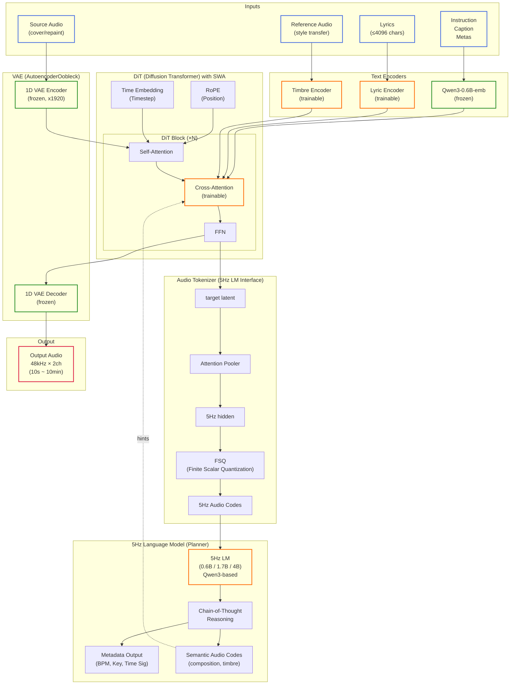

# ACE-Step V1.5 Model Architecture

## Technical Report

**arXiv**: [https://arxiv.org/abs/2602.00744](https://arxiv.org/abs/2602.00744)

## Overview

ACE-Step V1.5は**ハイブリッド・ツーブレイン・アーキテクチャ**を採用しています。

## Architecture Diagram (Mermaid)



## Architecture Diagram (ASCII)

```
┌─────────────────────────────────────────────────────────────────────────────┐
│                        ACE-Step V1.5 Architecture                           │
└─────────────────────────────────────────────────────────────────────────────┘

                              ┌─────────────────┐
                              │   User Input    │
                              │ (Caption/Lyrics)│
                              └────────┬────────┘
                                       │
         ┌─────────────────────────────┼─────────────────────────────┐
         │                             │                             │
         ▼                             ▼                             ▼
┌─────────────────┐        ┌─────────────────┐        ┌─────────────────┐
│  Qwen3-0.6B-emb │        │  Lyric Encoder  │        │ Timbre Encoder  │
│  (Text Encoder) │        │   (trainable)   │        │   (trainable)   │
│    (frozen)     │        │                 │        │                 │
└────────┬────────┘        └────────┬────────┘        └────────┬────────┘
         │                          │                          │
         └──────────────────────────┼──────────────────────────┘
                                    │
                                    ▼
┌───────────────────────────────────────────────────────────────────────────┐
│                  DiT (Diffusion Transformer) with SWA                     │
│  ┌─────────────────────────────────────────────────────────────────────┐  │
│  │                        DiT Block (×N)                               │  │
│  │   ┌────────────┐    ┌────────────────┐    ┌─────────────────────┐   │  │
│  │   │Self-Attn   │───▶│  Cross-Attn    │───▶│   Feed Forward      │   │  │
│  │   │            │    │  (trainable)   │    │   Network (FFN)     │   │  │
│  │   └────────────┘    └────────────────┘    └─────────────────────┘   │  │
│  │         ▲                    ▲                                      │  │
│  │         │                    │                                      │  │
│  │    ┌────┴────┐          ┌────┴────┐                                 │  │
│  │    │  RoPE   │          │Time Emb │                                 │  │
│  │    │(Position)│         │(Timestep)│                                │  │
│  │    └─────────┘          └─────────┘                                 │  │
│  └─────────────────────────────────────────────────────────────────────┘  │
└───────────────────────────────────────────────────────────────────────────┘
                                    │
         ┌──────────────────────────┴──────────────────────────┐
         │                                                      │
         ▼                                                      ▼
┌─────────────────────┐                            ┌─────────────────────────┐
│ 1D VAE Decoder      │                            │  Audio Tokenizer        │
│ (frozen)            │                            │  (for 5Hz LM)           │
│                     │                            │  ┌───────────────────┐  │
└─────────┬───────────┘                            │  │ Attention Pooler  │  │
          │                                        │  │       ↓           │  │
          ▼                                        │  │   5Hz hidden      │  │
┌─────────────────────┐                            │  │       ↓           │  │
│    Output Audio     │                            │  │      FSQ          │  │
│  48kHz × 2 channel  │                            │  │       ↓           │  │
│   (10s ~ 10min)     │                            │  │ 5Hz Audio Codes   │  │
└─────────────────────┘                            │  └───────────────────┘  │
                                                   └────────────┬────────────┘
                                                                │
                                                                ▼
                                                   ┌─────────────────────────┐
                                                   │  5Hz Language Model     │
                                                   │  (Planner - Qwen3)      │
                                                   │  ┌───────────────────┐  │
                                                   │  │  Chain-of-Thought │  │
                                                   │  │    Reasoning      │  │
                                                   │  └─────────┬─────────┘  │
                                                   │            │            │
                                                   │   ┌────────┴────────┐   │
                                                   │   ▼                 ▼   │
                                                   │ Metadata      Semantic  │
                                                   │ (BPM,Key)   Audio Codes │
                                                   └─────────────────────────┘
```

## Graphviz Diagram (SVG)

SVGを生成するには以下のコマンドを実行してください:

```bash
# Install Graphviz
sudo apt-get install graphviz  # Ubuntu/Debian
brew install graphviz          # macOS

# Generate SVG from dot file
dot -Tsvg architecture.dot -o architecture.svg

# Generate PNG
dot -Tpng architecture.dot -o architecture.png
```

オンラインでレンダリング:
- [GraphvizOnline](https://dreampuf.github.io/GraphvizOnline/) - `architecture.dot` の内容を貼り付け
- [Kroki](https://kroki.io/) - API経由でレンダリング

生成後、以下で表示:


---

## Main Components

### 1. Text Encoders

| Component | Model | Status | Role |
|-----------|-------|--------|------|
| **Text Encoder** | Qwen3-0.6B-emb | Frozen | Caption/Instruction encoding |
| **Lyric Encoder** | Custom | Trainable | Lyrics structure encoding |
| **Timbre Encoder** | Custom | Trainable | Reference audio style encoding |

### 2. DiT (Diffusion Transformer) - Executor

**Role**: 高品質なオーディオを拡散プロセスで生成

- **Architecture**: Transformer + Diffusion with Sliding Window Attention (SWA)
- **Position Encoding**: RoPE (Rotary Position Embedding)
- **Conditioning**: Cross-Attention for text/lyrics embeddings
- **Inference Steps**: 8 (turbo) or 50 (base/sft)

**Model Variants**:
| Model | Steps | CFG | Quality | Speed |
|-------|-------|-----|---------|-------|
| `acestep-v15-turbo` | 8 | No | Very High | Fast |
| `acestep-v15-sft` | 50 | Yes | High | Slow |
| `acestep-v15-base` | 50 | Yes | Medium | Slow |

### 3. VAE (AutoencoderOobleck)

- **Type**: 1D Variational Autoencoder
- **Compression**: ×1920 (latent 1 frame ≈ 1920 audio samples at 48kHz)
- **Status**: Frozen (pre-trained)
- **Decode**: Tiled decoding for memory efficiency

### 4. 5Hz Language Model - Planner

**Role**: 全能の計画者として、ユーザー入力を理解し音楽生成を計画

- **Base**: Qwen3 (0.6B / 1.7B / 4B)
- **Output Rate**: 5Hz (5 tokens per second of audio)
- **Features**:
  - Chain-of-Thought reasoning
  - Metadata generation (BPM, Key, Time Signature)
  - Semantic audio code generation

**Model Variants**:
| Model | Size | Audio Understanding | Composition |
|-------|------|---------------------|-------------|
| `acestep-5Hz-lm-0.6B` | 0.6B | Medium | Medium |
| `acestep-5Hz-lm-1.7B` | 1.7B | Medium | Medium |
| `acestep-5Hz-lm-4B` | 4B | Strong | Strong |

### 5. Audio Tokenizer

- **Input**: DiT latent representation
- **Process**: Attention Pooler → 5Hz hidden → FSQ (Finite Scalar Quantization)
- **Output**: 5Hz audio codes for LM interface

## Data Flow

```
1. Text Input
   ├─ Caption/Instruction → Qwen3-0.6B-emb → Text Embeddings
   ├─ Lyrics → Lyric Encoder → Lyric Embeddings
   └─ Reference Audio → Timbre Encoder → Style Embeddings

2. (Optional) LM Phase
   ├─ Text Embeddings → 5Hz LM
   ├─ Chain-of-Thought Reasoning
   └─ Output: Metadata + Semantic Codes

3. DiT Phase
   ├─ Noise → Diffusion Process (reverse)
   ├─ Conditioning: Text + Lyrics + Style + (LM hints)
   └─ Output: Target Latent

4. Decode Phase
   ├─ Target Latent → VAE Decoder (tiled)
   └─ Output: 48kHz Stereo Audio (10s ~ 10min)
```

## Key Features

- **Hybrid Architecture**: LM (planning) + DiT (execution)
- **Long Audio**: Supports 10 seconds to 10 minutes
- **Multi-task**: Text2Music, Cover, Repaint, Vocal2BGM
- **Low VRAM**: Runs on < 4GB with CPU offloading
- **50+ Languages**: Multi-lingual lyrics support

## References

- **Technical Report**: [arXiv:2602.00744](https://arxiv.org/abs/2602.00744)
- **Project Page**: [ACE-Step Project](https://ace-step.github.io/ace-step-v1.5.github.io/)
- **HuggingFace**: [ACE-Step/Ace-Step1.5](https://huggingface.co/ACE-Step/Ace-Step1.5)
- **ModelScope**: [ACE-Step/Ace-Step1.5](https://modelscope.cn/models/ACE-Step/Ace-Step1.5)

## Official Architecture Diagram

See `../assets/ACE-Step_framework.png` in the project root for the official architecture diagram.


